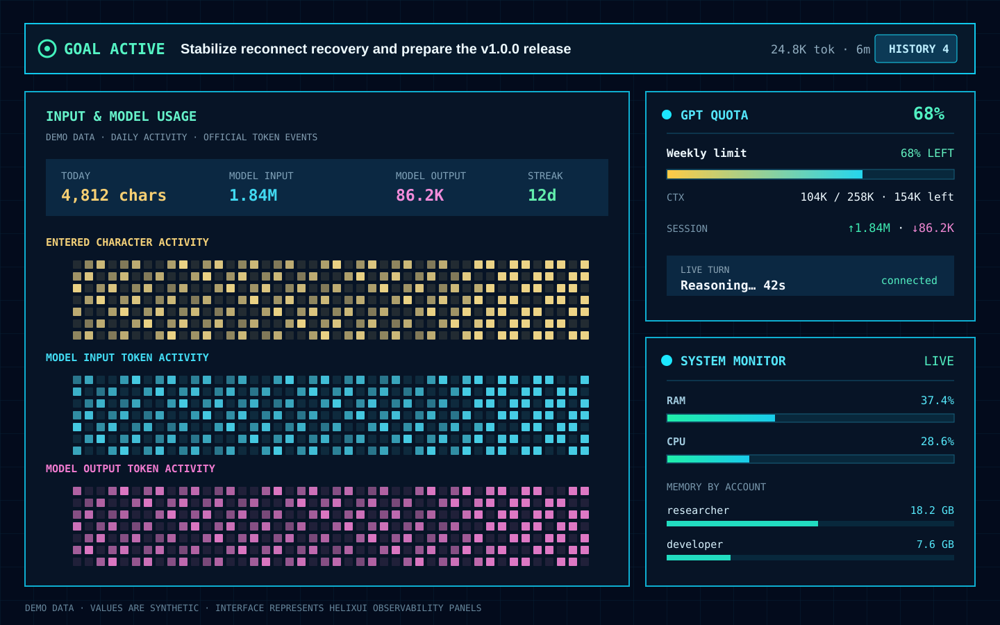
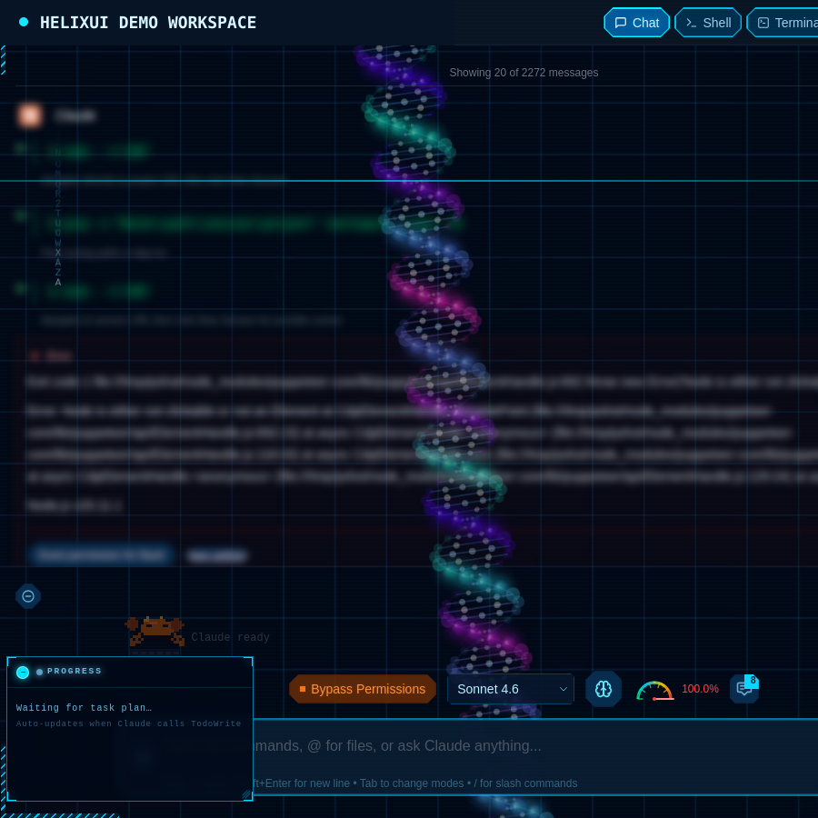

<div align="center">
  
  <h1>HelixUI</h1>
  <p><strong>The observable control surface for long-running AI coding work.</strong></p>
  <p>Persistent agents, live goals, terminal-grade sessions, and an operations HUD in one self-hosted workspace.</p>
</div>

<p align="center">
  <a href="https://github.com/StewartJohn0/helixui/actions/workflows/ci.yml"></a>
  <a href="https://www.npmjs.com/package/@stewiejohn/helixui"></a>
  <a href="package.json"></a>
  <a href="LICENSE"></a>
  <a href="./README.zh-CN.md">中文</a>
</p>

<p align="center">
  
</p>
<p align="center"><sub>Goal, usage, quota, live-turn, and system panels shown with synthetic demo data.</sub></p>

HelixUI is not just a browser wrapper around an agent CLI. It is a visual
operations workspace for people who keep several AI coding sessions running,
return to them from different devices, and need to know what is active, what
finished, what consumed context, and what the host machine is doing.

It runs Claude Code, OpenAI Codex, Cursor CLI, Gemini CLI, and compatible custom
providers while keeping the terminal-native workflow underneath.

## What makes it different

### See the work, not only the final answer

- A persistent **live-turn status bar** wakes immediately when work starts and
  survives reconnects and page refreshes.
- **Goal mode** exposes the active objective, elapsed time, token activity,
  pause/stop controls, completion state, and per-conversation goal history.
- Tool calls remain compact and readable; long commands, logs, test output, and
  errors are folded without hiding the fact that they happened.
- Completed turns get a durable end marker, so a long session never leaves you
  guessing where one answer ended.

### Treat usage and capacity as first-class signals

- **Quota and context HUD** for provider limits, reset times, context occupancy,
  and current-session token direction.
- **Input & Model Usage** views separate entered characters from official model
  input/output token events, with account totals and calendar heatmaps.
- **System Monitor** shows RAM, CPU, GPU/VRAM, and memory aggregated by account,
  making runaway multi-process workloads visible.
- Panels update independently without reloading or reflowing the chat surface.

### Keep terminal continuity without giving up a real UI

- Persistent Chat, Shell, and PTY Terminal surfaces reconnect to their existing
  session instead of starting over when a tab is reopened.
- Follow-up messages are isolated by browser tab and conversation, with clear
  queued/interrupt semantics during an active turn.
- Files, fuzzy search, drag-and-drop, source control, diffs, and editing stay
  scoped to the selected workspace.
- Desktop, compact-screen, mobile, multilingual, voice-to-text, and PWA flows
  share the same session state.

## The workspace

<p align="center">
  
</p>

The optional technology theme uses a DNA double-helix scene, grid-aligned
surfaces, compact HUD panels, and color-coded terminal output. Two restrained
themes are included for users who prefer a conventional workspace. Visual
styling never changes session behavior or provider data.

## Capability map

| Area | Included |
| --- | --- |
| Agents | Claude Code, OpenAI Codex, Cursor CLI, Gemini CLI, OpenAI-compatible providers |
| Conversations | Streaming, reconnect recovery, queued follow-ups, stable turn boundaries, session folders |
| Long-running work | Live work state, Goal mode, Goal history, stop/pause controls, completion markers |
| Observability | Quota, context, official token usage, character activity, account usage, system resources |
| Workspace | Files, fuzzy search, drag-and-drop, editor, diffs, Git, project-scoped navigation |
| Terminal | Real PTYs, reconnectable buffers, session continuity, Ctrl+C and interactive programs |
| Access | Built-in accounts, admin controls, per-user data boundaries, responsive/PWA interface |
| Experience | Three themes, multilingual UI, voice-to-text, math rendering, compact tool output |

## Quick start

### npm

```bash
npm install -g @stewiejohn/helixui
helix-ui
```

### Source

```bash
git clone https://github.com/StewartJohn0/helixui.git
cd helixui
npm ci --include=dev
cp .env.example .env
npm run build
npm run server
```

Open `http://127.0.0.1:3001`. The first account created in an empty database
becomes the administrator, and public registration closes immediately.

Runtime state is stored outside the checkout under `~/.cloudcli`. Workspaces
default to `~/CloudCLIWorkspaces`.

## Requirements

- Node.js 22 or newer
- Linux or macOS for the full PTY experience
- At least one supported agent CLI installed and authenticated

| Provider | Required local tool |
| --- | --- |
| Claude | Claude Code CLI |
| OpenAI | Codex CLI |
| Cursor | Cursor CLI |
| Google | Gemini CLI |
| Compatible APIs | Provider base URL and API key |

Provider credentials and native agent sessions remain on the machine running
HelixUI.

## Security model

HelixUI can execute shell commands with the permissions of its Unix account.
Keep the default localhost binding unless an authenticated HTTPS reverse proxy
and firewall protect the service. Application accounts are not an operating
system sandbox; mutually untrusted users require separate containers, virtual
machines, Unix accounts, or HelixUI instances.

Before network deployment, read [SECURITY.md](SECURITY.md) and the
[public deployment guide](docs/PUBLIC_DEPLOYMENT.md).

```env
HOST=127.0.0.1
PORT=3001
WORKSPACES_ROOT=/absolute/path/to/dedicated/workspaces
CLOUDCLI_DATA_DIR=/absolute/path/to/persistent/private/data
ALLOWED_HOSTS=helix.example.com
CORS_ORIGIN=https://helix.example.com
WS_ALLOWED_ORIGINS=https://helix.example.com
JWT_SECRET=replace-with-64-random-hex-characters
CREDENTIALS_ENCRYPTION_KEY=replace-with-64-random-hex-characters
```

## Release quality

`npm run release:check` scans for private deployment data and secrets, exercises
reconnect/idempotency and security-boundary tests, type-checks and builds the
frontend, installs the packed npm artifact in a clean home, verifies runtime
isolation, and audits production dependencies.

## Documentation

| Guide | Purpose |
| --- | --- |
| [.env.example](.env.example) | Configuration reference and secure defaults |
| [Deployment](docs/DEPLOYMENT.md) | Local and reverse-proxy deployment |
| [Public deployment](docs/PUBLIC_DEPLOYMENT.md) | Internet-facing threat model and hardening |
| [Security policy](SECURITY.md) | Trust boundaries and vulnerability reporting |
| [Support](SUPPORT.md) | Safe bug reports and diagnostics |
| [Contributing](CONTRIBUTING.md) | Development and pull-request workflow |
| [Versioning](docs/VERSIONING.md) | Independent semantic-version scheme |
| [Releasing](docs/RELEASING.md) | GitHub and npm maintainer procedure |

## Versioning

HelixUI starts its independent stable line at `1.0.0` under
`@stewiejohn/helixui`. The historical `@stewiejohn/helix-ui@1.23.0` package is
the legacy compatibility line. See [VERSIONING.md](docs/VERSIONING.md).

## Acknowledgments

HelixUI is a fork of
[siteboon/claudecodeui](https://github.com/siteboon/claudecodeui). The upstream
project supplied the original server architecture, session management, and
multi-agent integration framework.

## License

[AGPL-3.0-or-later](LICENSE). Network users must be offered the corresponding
source as required by the license.
