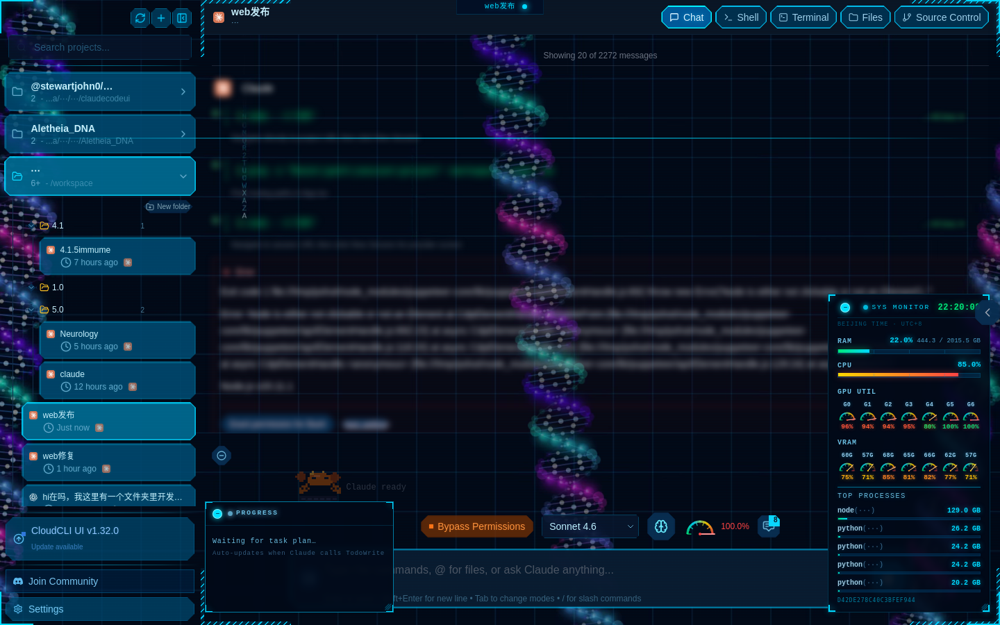
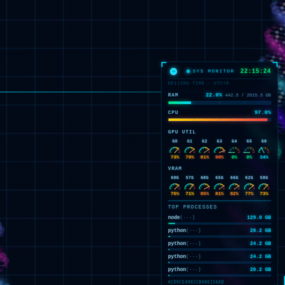
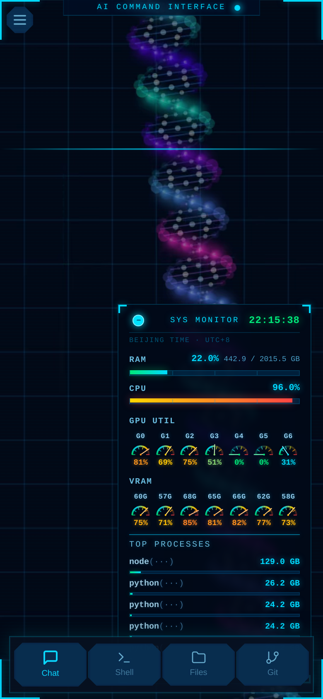
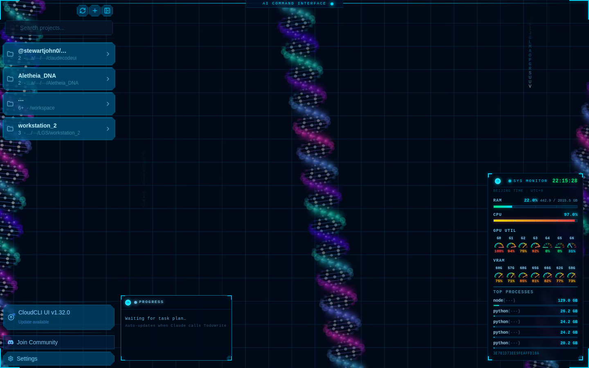

<div align="center">
  
  <h1>HelixUI</h1>
  <p><em>A sci-fi web interface for AI coding agents — built for researchers who think in helices.</em></p>
</div>

<p align="center">
  <a href="https://github.com/StewartJohn0/helixui/issues"></a>
  <a href="LICENSE"></a>
  <a href="https://github.com/StewartJohn0/helixui/releases"></a>
</p>

<div align="right"><i><b>English</b> · <a href="./README.zh-CN.md">中文</a> · <a href="./README.ko.md">한국어</a> · <a href="./README.ja.md">日本語</a></i></div>

---

HelixUI is a desktop and mobile web UI for running AI coding agents — [Claude Code](https://docs.anthropic.com/en/docs/claude-code), [Cursor CLI](https://docs.cursor.com/en/cli/overview), [OpenAI Codex](https://openai.com/codex), [Gemini CLI](https://github.com/google-gemini/gemini-cli), and any **custom OpenAI-compatible provider** (DeepSeek, Qwen, Mistral, etc.).

It gives you a full-featured, visually immersive interface accessible from any device — desktop, tablet, or mobile — with a sci-fi aesthetic designed around the DNA double-helix motif.

## Screenshots

<div align="center">

### Full Desktop Interface — DNA Helix Background · HUD System Monitor · Multi-session Sidebar


<br><br>

<table>
<tr>
<td align="center">
<h3>HUD System Monitor</h3>

<p><em>Real-time RAM · CPU · GPU · VRAM gauges</em></p>
</td>
<td align="center">
<h3>Mobile Interface</h3>

<p><em>Responsive · Touch-native · PWA</em></p>
</td>
</tr>
<tr>
<td align="center" colspan="2">
<h3>Integrated Shell Terminal</h3>

<p><em>Full PTY terminal with reconnect & buffer replay</em></p>
</td>
</tr>
</table>

</div>

## Features

- **Multi-agent Support** — Claude Code, Cursor CLI, Codex, Gemini CLI, and any custom provider via OpenAI-compatible API
- **Custom Providers** — Add DeepSeek, Qwen, Mistral, or any self-hosted model in Settings → API
- **Immersive UI** — DNA-helix background, HUD-style overlays, sci-fi visual theme
- **Integrated Shell Terminal** — Full PTY terminal with reconnection and buffer replay
- **Real-time Chat** — WebSocket-based streaming with stable, non-collapsing tool output blocks
- **File Explorer & Editor** — Browse, edit, and save files with syntax highlighting
- **Git Explorer** — Stage, commit, and switch branches from the UI
- **Session Management** — Persistent sessions, folder organization, cross-device access
- **Mobile-first Design** — Responsive layout with touch navigation and PWA support
- **TaskMaster AI** *(optional)* — AI-powered task planning and PRD parsing

## Quick Start

### Run without installing

```bash
npx @stewiejohn/helix-ui
```

Opens at `http://localhost:3001`.

### Global install

```bash
npm install -g @stewiejohn/helix-ui
helix-ui
```

### Self-hosted from source

```bash
git clone https://github.com/StewartJohn0/helixui.git
cd helixui
npm install
cp .env.example .env
npm run dev
```

## Custom Providers

HelixUI supports any Claude-compatible or OpenAI-compatible API endpoint via environment variable injection.

1. Go to **Settings → API → Custom Providers**
2. Add your provider: name, model ID, base URL, API key
3. The provider appears as a selectable option on the new session screen

Works with: DeepSeek, Qwen, Mistral, LM Studio, Ollama (via LiteLLM proxy), and more.

## Configuration

Copy `.env.example` to `.env` and adjust as needed:

```env
PORT=3001                        # Server port
HOST=0.0.0.0                     # Bind address
WORKSPACES_ROOT=/your/workspace  # Root for file access
CLAUDE_CLI_PATH=claude           # Path to claude CLI if non-default
CONTEXT_WINDOW=160000            # Max tokens per session
```

## Prerequisites

- Node.js v22+
- One or more AI CLI tools installed: [Claude Code](https://docs.anthropic.com/en/docs/claude-code), [Cursor CLI](https://docs.cursor.com/en/cli/overview), [Codex](https://openai.com/codex), or [Gemini CLI](https://github.com/google-gemini/gemini-cli)

## Security Notes

All Claude Code tools are **disabled by default**. Enable only what you need in Settings → Agents → Permissions.

## Architecture

```
┌─────────────────┐    ┌──────────────────┐    ┌─────────────────┐
│  Frontend        │    │  Backend          │    │  Agent CLI      │
│  React + Vite    │◄──►│  Express + WS     │◄──►│  Claude/Cursor  │
│  TypeScript      │    │  Node.js          │    │  Codex/Gemini   │
└─────────────────┘    └──────────────────┘    └─────────────────┘
```

## Acknowledgments

HelixUI is a fork of [**claudecodeui**](https://github.com/siteboon/claudecodeui) by [Siteboon](https://siteboon.ai), used under the AGPL-3.0 license. The original project provided the foundational server architecture, session management, and multi-agent integration framework.

Significant changes in this fork:
- Complete visual redesign — sci-fi / DNA-helix aesthetic (DNA background, HUD overlays, dark immersive theme)
- Custom provider support (any OpenAI-compatible endpoint)
- Shell terminal reconnection and PTY buffer replay
- Collapsible tool output stability fixes (isTrusted filtering, key stability)
- Chat stuck-state recovery for long-running tool executions

## License

[AGPL-3.0-or-later](LICENSE) © 2026 Stewart John

This project is a fork of [siteboon/claudecodeui](https://github.com/siteboon/claudecodeui) (AGPL-3.0). As required by the license, this fork is distributed under the same terms. Source code is available in this repository.
