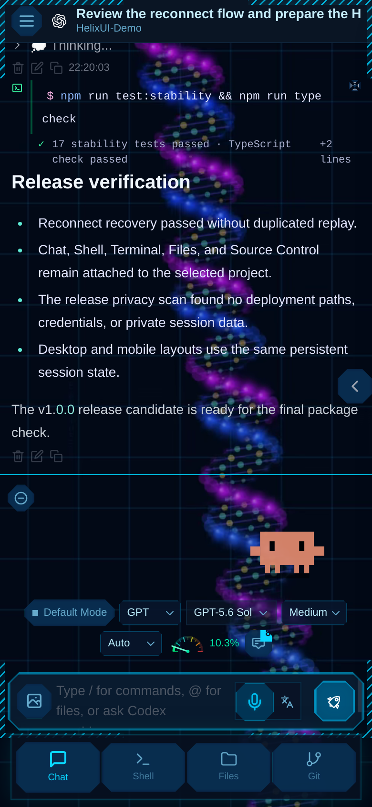

<div align="center">
  
  <h1>HelixUI</h1>
  <p><strong>面向长时间 AI 编程工作的可观测控制台。</strong></p>
  <p>把持久代理、实时 Goal、终端级会话和运行状态 HUD 放进同一个自托管工作区。</p>
</div>

<p align="center">
  <a href="https://github.com/StewartJohn0/helixui/actions/workflows/ci.yml"></a>
  <a href="https://www.npmjs.com/package/@stewiejohn/helixui"></a>
  <a href="package.json"></a>
  <a href="LICENSE"></a>
  <a href="./README.md">English</a>
</p>

<p align="center">
  
</p>
<p align="center"><sub>来自隔离演示实例的真实 HelixUI 浏览器截图。账号、用量、额度和系统数值均为由真实界面渲染的隐私安全演示数据。</sub></p>

HelixUI 不只是把代理 CLI 套进浏览器。它是为同时运行多个 AI 编程会话、需要从
不同设备回来继续工作，并且关心“谁正在运行、何时结束、占用了多少上下文、主机
是否过载”的用户设计的可视化运行工作区。

它接入 Claude Code、OpenAI Codex、Cursor CLI、Gemini CLI 和兼容的自定义服务，
同时保留底层终端原生工作方式。

## 它有什么不同

### 不只看最终答案，还能看见工作过程

- 持久的**实时工作状态栏**在任务开始时立即唤醒，并能跨刷新和断线恢复。
- **Goal 模式**集中展示当前目标、已用时间、Token 活动、暂停/停止、完成状态和
  当前对话的 Goal 历史。
- 工具调用保持紧凑可读；长命令、日志、测试输出和错误会折叠，但不会被吞掉。
- 每轮完成后保留明确的结束标志，长会话中不需要猜测本轮是否已经结束。

### 把额度、Token 和系统容量作为一等信息

- **Quota 与上下文 HUD**显示额度、重置时间、上下文占用和当前会话 Token 方向。
- **输入与模型用量**将键入字符和官方模型 input/output token 事件分开统计，并
  提供账号总览及日历热图。
- **系统监控**展示 RAM、CPU、GPU/VRAM，并按账号聚合内存，能够发现同一账号
  同时启动大量小进程导致的资源异常。
- 各面板独立更新，不依靠刷新整个页面，也不会让 Chat 内容反复重排。

### 保留终端连续性，同时获得完整图形界面

- Chat、Shell 和真实 PTY Terminal 会重连到原会话，切换页面或重新打开标签后
  不会从空终端开始。
- 工作进行时的后续消息具备明确的排队和 Interrupt 语义，并按浏览器标签和会话
  隔离。
- 文件、模糊搜索、拖放、编辑、Diff 和 Git 始终限制在当前工作区。
- 桌面、小屏、移动端、多语言、语音转文字和 PWA 共享一致的会话状态。

## 工作区

### 完整桌面控制台

<p align="center">
  
</p>

可选的科技主题使用 DNA 双螺旋场景、网格化界面、紧凑 HUD 和终端式彩色输出。
同时提供两套更克制的传统工作主题。视觉风格不会改变会话行为或模型数据。

### 在手机上延续同一个运行会话

<p align="center">
  
</p>
<p align="center"><sub>来自同一隔离演示实例的真实完整纵向手机截图；Chat、Shell、Files 和 Git 一键切换。</sub></p>

手机版不是只能查看结果的精简页面。它能够重连到同一个活动轮次、恢复缓冲进度、
发送后续消息、查看 Goal 状态，并在 Chat、Shell、Files 和 Git 之间切换，而不会
额外创建第二个会话。

## 能力总览

| 范围 | 包含能力 |
| --- | --- |
| 代理 | Claude Code、OpenAI Codex、Cursor CLI、Gemini CLI、OpenAI 兼容服务 |
| 对话 | 流式输出、断线恢复、后续消息队列、稳定轮次边界、会话文件夹 |
| 长任务 | 实时工作状态、Goal 模式、Goal 历史、暂停/停止、完成标志 |
| 可观测性 | Quota、上下文、官方 Token、键入字符、账号用量、系统资源 |
| 工作区 | Files、模糊搜索、拖放、编辑器、Diff、Git、项目级导航 |
| 终端 | 真实 PTY、重连缓冲、会话延续、Ctrl+C 与交互程序 |
| 访问 | 内置账号、管理员控制、用户数据边界、响应式/PWA |
| 体验 | 三套主题、多语言、语音转文字、公式渲染、紧凑工具输出 |

## 快速开始

### npm 安装

```bash
npm install -g @stewiejohn/helixui
helix-ui
```

### 从源码安装

```bash
git clone https://github.com/StewartJohn0/helixui.git
cd helixui
npm ci --include=dev
cp .env.example .env
npm run build
npm run server
```

打开 `http://127.0.0.1:3001`。空数据库中创建的第一个账号会成为管理员，随后
公开注册立即关闭。运行数据保存在源码目录外的 `~/.cloudcli`，工作区默认为
`~/CloudCLIWorkspaces`。

## 环境与代理

- Node.js 22 或更高版本
- 完整 PTY 功能需要 Linux 或 macOS
- 至少安装并登录一个受支持的代理 CLI

| 服务 | 本机依赖 |
| --- | --- |
| Claude | Claude Code CLI |
| OpenAI | Codex CLI |
| Cursor | Cursor CLI |
| Google | Gemini CLI |
| 兼容 API | 服务地址与 API Key |

代理凭据和原生会话保留在运行 HelixUI 的机器上。

## 安全边界

HelixUI 会以启动它的 Unix 账号权限执行命令。除非服务受到 HTTPS 反向代理、
身份认证和防火墙保护，否则应保持默认的本机监听。网页账号不能替代操作系统
沙箱；互不信任的用户必须使用不同容器、虚拟机、Unix 账号或 HelixUI 实例。

网络部署前请阅读 [安全策略](SECURITY.md) 和
[公网部署指南](docs/PUBLIC_DEPLOYMENT.md)。

```env
HOST=127.0.0.1
PORT=3001
WORKSPACES_ROOT=/独立工作区的绝对路径
CLOUDCLI_DATA_DIR=/持久化私有数据的绝对路径
ALLOWED_HOSTS=helix.example.com
CORS_ORIGIN=https://helix.example.com
WS_ALLOWED_ORIGINS=https://helix.example.com
JWT_SECRET=替换为64位随机十六进制字符串
CREDENTIALS_ENCRYPTION_KEY=替换为另一段64位随机十六进制字符串
```

## 发布质量

`npm run release:check` 会扫描私有部署信息和秘密，执行断线重连、幂等性与安全边界
测试，完成类型检查和生产构建，在全新 HOME 下安装 npm 包并验证运行数据隔离，
最后审计生产依赖。

## 文档

| 文档 | 内容 |
| --- | --- |
| [.env.example](.env.example) | 配置说明与安全默认值 |
| [部署指南](docs/DEPLOYMENT.md) | 本机和反向代理部署 |
| [公网部署](docs/PUBLIC_DEPLOYMENT.md) | 公网威胁模型与加固 |
| [安全策略](SECURITY.md) | 信任边界和漏洞报告 |
| [支持说明](SUPPORT.md) | 安全提交 Bug 和诊断信息 |
| [参与贡献](CONTRIBUTING.md) | 开发与 Pull Request 流程 |
| [版本规则](docs/VERSIONING.md) | 独立语义化版本体系 |
| [发布流程](docs/RELEASING.md) | GitHub 与 npm 维护流程 |

## 版本、来源与许可

HelixUI 使用新的 npm 包 `@stewiejohn/helixui`，独立稳定版本从 `1.0.0`
开始。历史包 `@stewiejohn/helix-ui@1.23.0` 属于兼容阶段版本线，详见
[版本规则](docs/VERSIONING.md)。

本项目基于 [siteboon/claudecodeui](https://github.com/siteboon/claudecodeui)
开发，保留并感谢上游提供的原始服务器架构、会话管理和多代理集成框架。

项目按照 [AGPL-3.0-or-later](LICENSE) 发布。通过网络向用户提供服务时，必须按
许可证要求向用户提供对应源代码。
